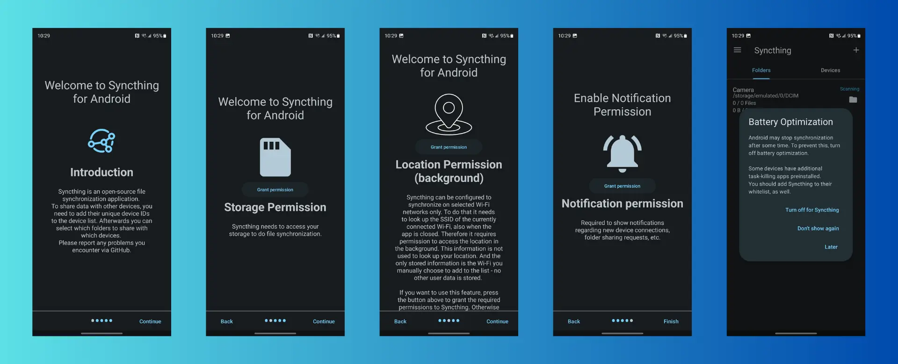

# WC25 - 09 • Syncthing & Obsidian  
  
  
  
Hồi mới sử dụng Obsidian, mình có viết bài [Cách mình đồng bộ Obsidian giữa các thiết bị](./cach-minh-dong-bo-obsidian-giua-cac-thiet-bi.md), nhưng sau một thời gian thì mình không còn dùng cách này nữa. Tức là thay vì dùng máy chủ trung gian (đám mây như Dropbox, Google Drive, OneDrive) mà mình đã chuyển qua phương thức peer-to-peer (P2P). Và mình đã dùng [Syncthing](https://syncthing.net/) để đồng bộ các dữ liệu trong vault Obsidian của mình ngót nghét cũng 2 năm rồi. Đây là một ứng dụng mã nguồn mở, miễn phí và được cộng đồng Obsidian khá tin dùng.  
  
Bài này mình sẽ chia sẻ lại một số kinh nghiệm của mình để các bạn có thể tham khảo mà trải nghiệm Obsidian tốt hơn.  
  
## Bản chất vault là gì?  
Obsidian lưu trữ ghi chú của bạn dưới dạng tệp văn bản thuần túy có định dạng Markdown trong một kho lưu trữ (vault). Vault là ==một thư mục== trên hệ thống tệp cục bộ, bao gồm mọi thư mục con [^1].  
  
Do đó, để sử dụng dữ liệu của mình trên nhiều thiết bị thì chúng ta chỉ là đồng bộ ==THƯ MỤC VAULT== trên các thiết bị.  
  
## Cài đặt Syncthing  
Mình hay dùng Windows và Android nên mình sẽ hướng dẫn trên 2 nền tảng này nha. Các nền tảng khác cũng gần tương tự.  
### Windows (tương tự với MacOS và Linux)  
  
Trước hết bạn truy cập [Syncthing | Downloads](https://syncthing.net/downloads/)  để tải phiên bản tương ứng với thiết bị của mình.   
  
Ở đây mình sẽ cài **Syncthing Windows Setup**, bạn chỉ việc tải bản mới nhất về (đôi khi máy sẽ tự nhận là phần mềm độc hại nên bạn phải cho phép Run anyway), mở file lên và Next, next, next liên tục, không cần chỉnh gì quá nhiều!  
  
  
  
Sau khi hoàn thành cài đặt, Syncthing sẽ tự chạy và mở giao diện làm việc tại địa chỉ `127.0.0.1:8384` hoặc `localhost:8384` (đánh dấu lại sau này sẽ dùng)  
  
Giao diện nó như thế này, bạn đi tới phần [Kết nối các thiết bị](https://thienqc.github.io/blog/post/WC25-09/#ket-noi-cac-thiet-bi) bên dưới.  
  
  
  
### Android  
Hiện nay, Syncthing không còn ra phiên bản Android chính thức nữa. Và trên trang chủ Syncthing gợi ý dùng [Syncthing-Fork](https://github.com/Catfriend1/syncthing-android) hoặc Syncthing-Lite để thay thế. Còn cá nhân mình thì lâu nay mình dùng phiên bản chính thức tải từ [syncthing/syncthing-android](https://github.com/syncthing/syncthing-android/releases) và chưa thấy có bug gì quá nhiều (v1.23.7).  
  
Đầu tiên các bạn vào [Releases · syncthing/syncthing-android](https://github.com/syncthing/syncthing-android/releases) và tải bản APK mới nhất (v1.28.1) về điện thoại và cài đặt.  
  
Sau khi cài đặt, bạn mở nó lên và đồng ý tất cả các quyền (Storage, Location, Notification) - nhấn vào `Grant permission` ở mỗi lựa chọn và chọn `Turn off for Syncthing`.  
  
  
  
Sau đó bạn nhấn vào nút `≡` bên trái --> `Web GUI` và đi tới phần [Kết nối các thiết bị](https://thienqc.github.io/blog/post/WC25-09/#ket-noi-cac-thiet-bi) bên dưới.  
  
> Bạn có thể tắt biểu tượng thông báo của Syncthing (Turn off notification) và không cần mở Syncthing mỗi khi đồng bộ vì lúc này ==Syncthing đã tự động chạy nền== rồi, nhưng cũng nên kiểm tra lại vì đôi khi bạn quên mà nhấn Exit nhé!  
  
### iOS/iPadOS  
Vì iOS có nhiều hạn chế khi 'can thiệp' trên thiết bị nên Syncthing không có tạo ra phiên bản dành cho iOS. Nhưng bạn có thể dùng [Sushitrain](https://github.com/pixelspark/sushitrain) hoặc [Möbius Sync](https://mobiussync.com/) (thu phí) để thay thế[^2]. Vì mình không sử dụng iphone nên không có review được!  
  
## Kết nối các thiết bị  
  
Sau khi cài đặt Syncthing trên các thiết bị, bạn nhấn vào nút `Add Remote Device`, nó sẽ hiện lên các thiết bị xung quanh, bạn chọn lần lượt từng ID, hoặc bạn có thể nhập thủ công, quét QR. Đặt tên cho dễ phân biệt. --> `Save`  
  
  
  
Ở thiết bị khác, nó sẽ hiện lên thông báo có một thiết bị cần kết nối --> `Add Device` --> đặt tên để phân biệt --> `Save`  
  
  
  
Nếu có 3 thiết bị trở lên, lặp lại bước này và đảm bảo các máy đều được kết nối với nhau. VD: A <-> B, B <-> C, C <-> A  
  
## Chia sẻ thư mục vault  
  
Bạn chọn `Add Folder`, nó sẽ hiện lên một cửa sổ với các tab:  
  
1. General  
	- Folder Label: tên thư mục  
	- Folder ID: giữ nguyên  
	- Folder Path: đường dẫn tới vault của bạn, mặc định sẽ lưu tại `C:\Users\{USER_NAME}` (Windows) hoặc `/storage/emulated/0` (Android) (viết tắt là dấu `~`)  
  
2. Sharing  
	- Chọn tất cả các thiết bị cần đồng bộ  
  
3. File Versioning  
	- No File Versioning  
  
4. Advanced  
	- Folder Type: Send & Receive  
  
5. Ignore Patterns  
	- Chọn `Add ignore patterns`  
	- Sau khi bấm `Save` sẽ hiện bảng để thêm vào  
  
```text  
**/workspace.json  
**/workspaces.json  
**/workspace-mobile.json  
```  
  
  
  
Bấm `Save`. Ở các thiết bị khác sẽ hiện lên một thông báo có một thư mục được chia sẻ --> `Add` --> chỉnh sửa các thông số như trên.  
  
  
  
Chờ một thời gian để các file được đồng bộ với nhau. Kiểm tra lại rằng thư mục vault này được chia sẻ trên tất các thiết bị. VD: trên máy A chia sẻ cho B và C; máy B chia sẻ cho C và A; và máy C chia sẻ cho A và B. Điều này sẽ đảm bảo cho dù có 1 máy offline thì dữ liệu giữa 2 máy online vẫn được đồng bộ.  
  
Thế là xong rồi đấy. Mở Obisidan trên từng máy và `Open folder as vault`  
### Để tự động đồng bộ  
Nếu bạn đã làm theo hướng dẫn ở trên thì Syncthing sẽ được chạy ẩn khi thiết bị được mở (không hiện Web GUI). Nhưng nếu nó không tự chạy, bạn có thể thiết lập theo [hướng dẫn này](https://docs.syncthing.net/users/autostart.html#autostart-windows-startup). Khi đó, Syncthing sẽ tự động mở mỗi khi máy tính được khởi động.   
  
**Trên Android**  
  
Bạn vào Settings → Run Conditions, kích hoạt các tuỳ chọn này  
- Enable run conditions  
- Run on Wi-Fi  
  
Lúc này, mỗi khi điện thoại được kết nối wi-fi thì Syncthing sẽ tự động chạy. Bạn cũng có thể ẩn thông báo từ Syncthing thì nó sẽ chạy ngầm, không ảnh hưởng bạn sử dụng điện thoại.  
  
## Lưu ý  
Sau thời gian dài trải nghiệm với cách setup như trên, mình hiếm khi bị các lỗi `config file`, mất file, các file được đồng bộ nhanh.   
  
Tuy nhiên, mình luôn tuân thủ nguyên tắc này khi sử dụng: **KHÔNG SỬ DỤNG OBSIDIAN TRÊN NHIỀU THIẾT BỊ TẠI CÙNG MỘT THỜI ĐIỂM**. Hiểu rõ hơn là không chỉnh sửa 1 file tại một thời điểm ở các máy khác nhau!  
  
Bên cạnh dùng Syncthing, mình còn dự phòng một bản lên Git để lưu trữ mỗi tháng, phòng khi sự cố bị mất file hoặc khi muốn xem nhanh file ở thiết bị lạ.  
  
> Mình ghi chú chủ yếu trên PC tại nhà. Khi ra đường, thì cầm theo điện thoại. Nếu có ý tưởng hay ghi chú gì ở điện thoại thì khi về nhà, dữ liệu mới sẽ được đồng bộ tự động qua PC. Đôi khi đổi gió, mình sẽ cầm laptop ra ngoài quán cà phê ngồi, lúc này dữ liệu cũng được cập nhật trên laptop và điện thoại. Khi về nhà, các dữ liệu đều được đồng bộ tự động thông qua Syncthing.  
  
Hi vọng qua bài viết này, bạn có thể thiết lập một hệ thống đồng bộ đơn giản cho bản thân. Nếu có bất kì thắc mắc nào, bạn có thể đặt câu hỏi [tại đây](https://www.facebook.com/groups/obsidian.secondbrain/posts/1186594446674689/).  
  
---  
**[08](./WC25-08.md) 👈 [WC25](./WC25.md) 👉 [10](./WC25-10.md)**  
  
[^1]: [How Obsidian stores data - Obsidian Help](https://help.obsidian.md/Files+and+folders/How+Obsidian+stores+data)  
  
[^2]: [FAQ — Syncthing documentation: Is there an iOS client?](https://docs.syncthing.net/users/faq.html#is-there-an-ios-client)